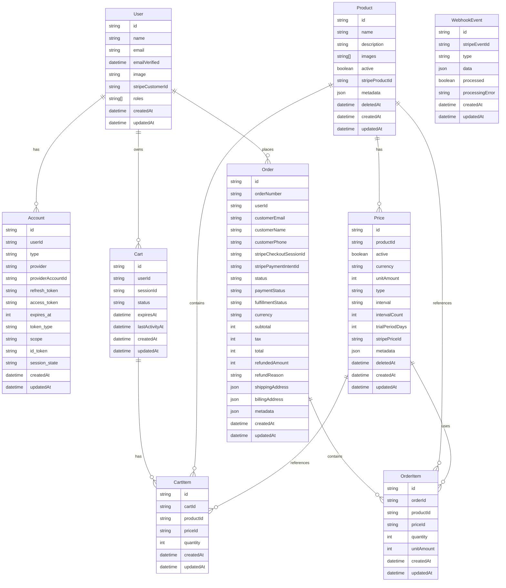

```mermaid
erDiagram

    %% ========== USERS & ACCOUNTS ==========
    User {
        string id
        string name
        string email
        datetime emailVerified
        string image
        string stripeCustomerId
        string[] roles
        datetime createdAt
        datetime updatedAt
    }

    Account {
        string id
        string userId
        string type
        string provider
        string providerAccountId
        string refresh_token
        string access_token
        int expires_at
        string token_type
        string scope
        string id_token
        string session_state
        datetime createdAt
        datetime updatedAt
    }

    User ||--o{ Account : has


    %% ========== PRODUCTS & PRICES ==========
    Product {
        string id
        string name
        string description
        string[] images
        boolean active
        string stripeProductId
        json metadata
        datetime deletedAt
        datetime createdAt
        datetime updatedAt
    }

    Price {
        string id
        string productId
        boolean active
        string currency
        int unitAmount
        string type
        string interval
        int intervalCount
        int trialPeriodDays
        string stripePriceId
        json metadata
        datetime deletedAt
        datetime createdAt
        datetime updatedAt
    }

    Product ||--o{ Price : has


    %% ========== CARTS ==========
    Cart {
        string id
        string userId
        string sessionId
        string status
        datetime expiresAt
        datetime lastActivityAt
        datetime createdAt
        datetime updatedAt
    }

    CartItem {
        string id
        string cartId
        string productId
        string priceId
        int quantity
        datetime createdAt
        datetime updatedAt
    }

    User ||--o{ Cart : owns
    Cart ||--o{ CartItem : has
    Product ||--o{ CartItem : contains
    Price ||--o{ CartItem : references


    %% ========== ORDERS ==========
    Order {
        string id
        string orderNumber
        string userId
        string customerEmail
        string customerName
        string customerPhone
        string stripeCheckoutSessionId
        string stripePaymentIntentId
        string status
        string paymentStatus
        string fulfillmentStatus
        string currency
        int subtotal
        int tax
        int total
        int refundedAmount
        string refundReason
        json shippingAddress
        json billingAddress
        json metadata
        datetime createdAt
        datetime updatedAt
    }

    OrderItem {
        string id
        string orderId
        string productId
        string priceId
        int quantity
        int unitAmount
        datetime createdAt
        datetime updatedAt
    }

    User ||--o{ Order : places
    Order ||--o{ OrderItem : contains
    Product ||--o{ OrderItem : references
    Price ||--o{ OrderItem : uses


    %% ========== WEBHOOK EVENTS ==========
    WebhookEvent {
        string id
        string stripeEventId
        string type
        json data
        boolean processed
        string processingError
        datetime createdAt
        datetime updatedAt
    }
```
