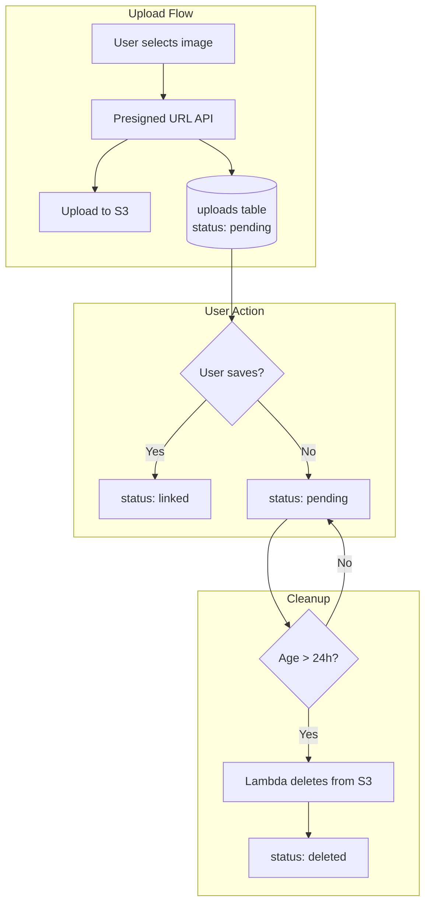

# Upload Cleanup System

This document describes the orphaned upload cleanup system that prevents S3 storage bloat from abandoned image uploads.

## Problem

When users upload images while creating/editing categories or products, the images are uploaded to S3 **immediately** (before the form is submitted). If users:

- Navigate away without saving
- Close the browser
- Click "Cancel"
- Remove images from the form but never submit

...the uploaded images remain in S3 indefinitely, causing storage costs to accumulate.

## Solution Architecture



## Components

### 1. Database: `uploads` Table

Tracks all uploads with their status.

**Schema:**

| Column               | Type      | Description                               |
| -------------------- | --------- | ----------------------------------------- |
| `id`                 | text (PK) | UUID                                      |
| `key`                | text      | S3 object key (unique)                    |
| `public_url`         | text      | Full public URL                           |
| `filename`           | text      | Original filename                         |
| `content_type`       | text      | MIME type                                 |
| `size`               | integer   | File size in bytes (optional)             |
| `folder`             | text      | Upload folder ("categories", "products")  |
| `status`             | enum      | `pending` \| `linked` \| `deleted`        |
| `linked_entity_id`   | text      | ID of linked category/product (if linked) |
| `linked_entity_type` | text      | "category" or "product" (if linked)       |
| `created_at`         | timestamp | When uploaded                             |
| `updated_at`         | timestamp | Last update                               |
| `linked_at`          | timestamp | When linked to entity                     |
| `deleted_at`         | timestamp | When marked for deletion                  |

### 2. API Routes

#### `POST /api/upload/presigned-url`

Generates presigned URL and records upload as `pending`.

#### `DELETE /api/upload/delete`

Deletes upload from S3 and marks as `deleted` in DB.

**Request:**

```json
{
  "publicUrl": "https://bucket.s3.region.amazonaws.com/folder/file.jpg"
}
```

#### `POST /api/upload/cleanup`

Called by Lambda to clean up orphaned uploads. Requires `Authorization: Bearer <secret>`.

**Request:**

```json
{
  "thresholdHours": 24,
  "batchSize": 100,
  "dryRun": false
}
```

**Response:**

```json
{
  "success": true,
  "message": "Cleaned up 5 orphaned uploads",
  "stats": {
    "found": 5,
    "deleted": 5,
    "failed": 0
  }
}
```

#### `GET /api/upload/cleanup`

Get stats about orphaned uploads (for monitoring).

### 3. Server Actions

#### `linkUpload(publicUrl, entityId, entityType)`

Links a single upload to a category.

#### `linkUploads(publicUrls[], entityId, entityType)`

Links multiple uploads to a product.

#### `unlinkUploads(entityId, entityType)`

Unlinks all uploads from an entity (marks as pending for cleanup).

### 4. Infrastructure (Pulumi)

#### Lambda Function

- **Runtime:** Node.js 20.x
- **Handler:** `upload-cleanup.handler`
- **Timeout:** 60 seconds
- **Memory:** 256 MB
- **Code:** `infra/lambdas/upload-cleanup.mjs`

#### EventBridge Schedule

- **Schedule:** Daily at 3 AM UTC (`cron(0 3 * * ? *)`)
- **Target:** Cleanup Lambda

## Configuration

### Environment Variables

| Variable                | Location | Description                       |
| ----------------------- | -------- | --------------------------------- |
| `UPLOAD_CLEANUP_SECRET` | Web app  | Secret token for cleanup API auth |
| `APP_URL`               | Lambda   | Base URL of the Next.js app       |
| `CLEANUP_SECRET`        | Lambda   | Same as `UPLOAD_CLEANUP_SECRET`   |

### Pulumi Config

```bash
# Set the cleanup secret (required)
pulumi config set --secret uploadCleanupSecret "your-secure-random-string"

# Optionally set the app URL (defaults based on stack)
pulumi config set appUrl "https://your-app.com"
```

## Deployment

### 1. Run Database Migration

```bash
cd packages/database
pnpm db:migrate
```

### 2. Set Environment Variables

Add to your `.env` or deployment config:

```env
UPLOAD_CLEANUP_SECRET=your-secure-random-string
```

### 3. Deploy Infrastructure

```bash
cd infra
pulumi config set --secret uploadCleanupSecret "your-secure-random-string"
pulumi up
```

## Flow Details

### Upload Flow

1. User selects image in form
2. `ImageUpload` component calls `POST /api/upload/presigned-url`
3. API generates presigned URL and inserts record into `uploads` table with `status: pending`
4. Component uploads file directly to S3 using presigned URL
5. Component receives and displays the public URL

### Save Flow

1. User submits category/product form
2. `createCategory` / `createProduct` action saves entity to DB
3. Action calls `linkUpload` / `linkUploads` to mark uploads as `linked`
4. Upload record updated with `linkedEntityId`, `linkedEntityType`, `linkedAt`

### Delete Image Flow (UI)

1. User clicks remove button on image
2. `ImageUpload` / `ProductForm` calls `DELETE /api/upload/delete`
3. API deletes file from S3
4. API marks upload record as `deleted`

### Cleanup Flow (Scheduled)

1. EventBridge triggers Lambda at 3 AM UTC daily
2. Lambda calls `POST /api/upload/cleanup` with auth token
3. API queries for uploads where `status = 'pending'` AND `created_at < (now - 24h)`
4. API deletes matching files from S3
5. API marks records as `deleted`
6. Lambda logs results to CloudWatch

## Monitoring

### CloudWatch Logs

Lambda logs include:

- Start time
- Number of orphaned uploads found
- Number successfully deleted
- Any errors

### Manual Stats Check

```bash
curl -X GET "https://your-app.com/api/upload/cleanup?thresholdHours=24" \
  -H "Authorization: Bearer your-secret"
```

### Dry Run

Test cleanup without deleting:

```bash
curl -X POST "https://your-app.com/api/upload/cleanup" \
  -H "Authorization: Bearer your-secret" \
  -H "Content-Type: application/json" \
  -d '{"dryRun": true}'
```

## Edge Cases

| Scenario                      | Handling                                                 |
| ----------------------------- | -------------------------------------------------------- |
| User still filling form       | 24-hour threshold prevents premature deletion            |
| Legacy uploads (pre-tracking) | `linkUpload` logs warning but continues; S3 delete works |
| S3 delete fails               | DB still marked deleted; can retry later                 |
| DB update fails               | S3 file deleted; orphaned DB record (harmless)           |
| Lambda times out              | Partial cleanup; next run continues                      |
| Multiple images on product    | `linkUploads` handles array of URLs                      |
